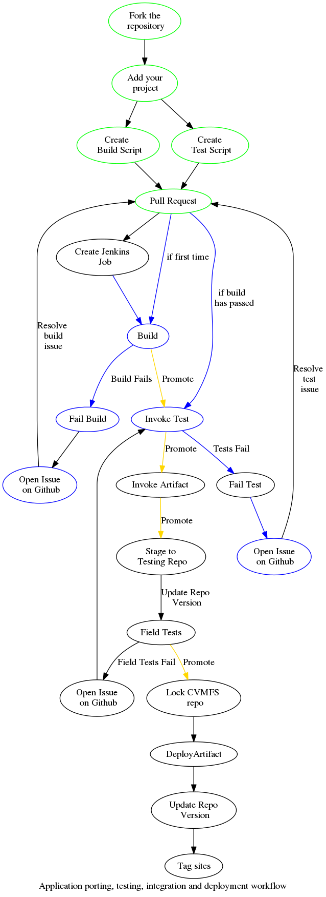

Here's what you need to know to get started.

# Scaffolding

We provide a bit of scaffolding to help you get started, but there isn't a full API. Who knows, maybe one day we'll get there. It wouldn't make much sense to require users to support the full toolchain of their application, including all of the dependencies. You want to do some research, we get it - and we're making this service available to speed up the procedure. The following components are provided to speed things up for you:

  * `Hello world` project examples
  * Prebuilt libraries, optimised per site
  * Modulefiles for easily adding them to your environment

You are encouraged to comment on and contribute to this scaffolding (by sending pull requests to this repo), of course.

# Porting Workflow

Assuming you're reading this with the intention of porting a new application to the grid, we're making a deal with you - you pull your weight, we'll pull ours. The deal of course is that you get to do as little as possible, and we get new applications that do science and don't break anything. The tools and workflow have been designed to minimise the overhead felt by application developers, while giving full transparency of the procedure to all stakeholders at every step.
The porting workflow is described in detail by the image below.

# "Successful" Branch

Nothing ever goes right the first time, but for the sake of argument, if your project will follow the following steps, it will end up as a supported application at sites mounting the SAGrid repo. There a few manual steps which you have to do (don't worry, we've got your back) first. Then, it's *'Jenkins, take the wheel!'. After all, what's the point of having a bunch of robots of they don't do most of the work for you ? If applications pass build and functional tests,

  1. **Manual steps**
    1. Check that you know how to build the application.
    2. Fork this repository
    3. Add your proposed application, in the form of a build script
    4. Send a pull request to the repository
  1. **Jenkins, take the wheel !**
    1. Build on target sites
    1. Invoke tests
    1. Invoke artifact
    1. Stage to testing repo
  1. **Certification**
    1. Inclusion in testing repo
    1. Field tests
  1. **Deployment**
    1. Lock CVMFS repo
    1. Deploy artifact
    2. Tag sites

## What do you have to do ?

So, what are the steps that you as researcher or developer of a new application have to do to get started ?

  * **Build the application yourself**: Although this step is optional, it's good practice to understand the needs of your application. Which dependencies does it need ? How should it be configured ? Which extra modules or data are required ? If you can build the application on your laptop or site, chance are that with a bit of extra work, you can get Jenkins to build it for the target sites.
  * **Fork this repository**: [Pretty self explanatory](https://github.com/SAGridOps/SoftwareInstallation/fork). You need to fork the repo so that you can work on your application, having all of the supporting scaffolding mentioned above.
  * **Add your project**: You'll see the repo is organised according to scientific domain. Choose the right one for your application, and create a subdirectory for your project (e.g. `Chemistry/Abinit`). We define different kinds of [sites](doc/Sites.md)
  * **Create the build script**: If you can build the application, write a script (in bash or whatever) that will execute the build.
    * **Outcomes**:
      * You add a new `build.sh`
      * Your build script creates executables and libraries which can be tested
  * **Define the tests yourself**: this step is man
  * [Send a pull request]:  as well as be able to send a [pull request](https://help.github.com/articles/using-pull-requests/).
  *
